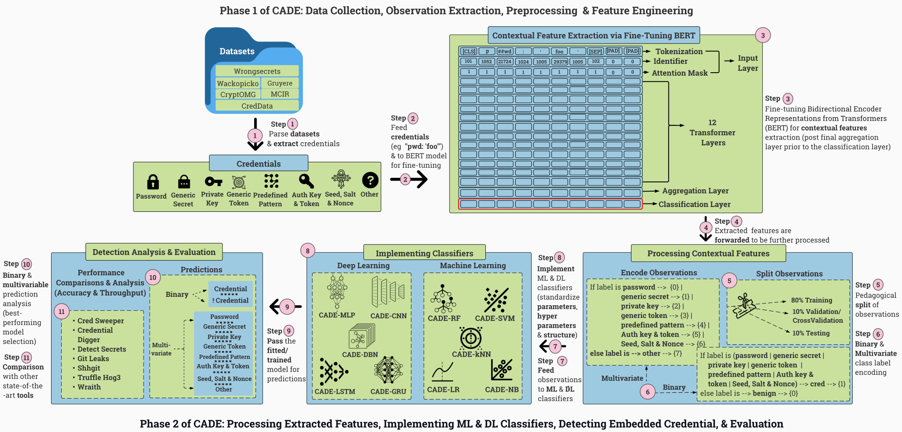

<h2 align = "center"> CADE </h2>

<p align="center">
  
</p>

Official implementation of CADE: Context-Aware Detection of Embedded Credentials, to undergo review at ACM DTRAP. For reviewer(s), please follow the instructions below to reproduce the results presented in the paper. 

## Installation
```
$ git clone https://github.com/biringaChi/CADE
$ cd CADE
$ pip install -r requirements.txt
```
## Datasets
### D<sub>1</sub>: CREDDATA (In-Distribution Training, Validation & Testing) 
CREDDATA is a benchmark credential dataset that comprises eight embedded credential types: Password (30.44%), Generic Secret (23.04%), Private Key (19.64%), Generic Token (21.65%), Predefined Pattern (7.14%), (Authentication Key & Token (1.46%)), (Seed, Salt & Nonce (0.85%)), and Other(8.16%)}. 4,583 is the total number of positive observations, and Ground truth in CADE is labeled {T, F}, where "T" indicates a positive class (an embedded credential), and "F" indicate a negative class (the inverse of T). Please visit [CREDDATA REPOSITORY](https://github.com/Samsung/CredData) for more information.

#### Generating Embedded Credentials

Unzip repository directories and corresponding metadata
```
$ cd datasets/creddata
$ for f in *.gz; do tar xf "$f"; done 
$ cd ...; CADE/preproc
```
Extract Raw Observations (Binary)
```
TODO
```
Extract Raw Observations (Multiclass)
```
$ python ctrext.py
```
### D<sub>2</sub>: Case Studies [WrongSecrets, Wackopicko, Grueyere, CryptOMG, MCIR] (Out-of-Distribution Detection)
**TODO**
