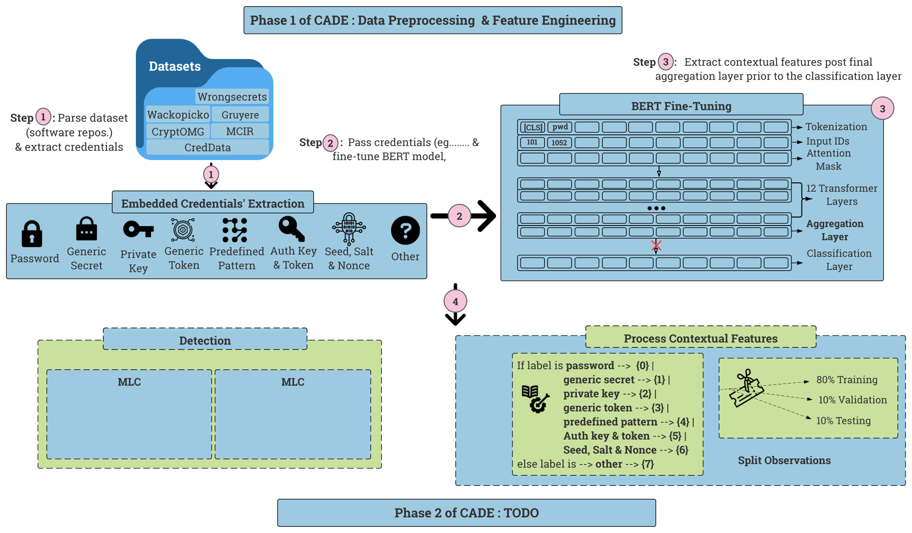

CADE: Context-Aware Detection of Embedded Credentials

  

Official implementation of CADE, to undergo review and artifact evaluation at USENIX ATC. I will provide full details on the project post notification. 

For artifact evaluator(s), please follow the instructions below to reproduce the results presented in the paper. 

***TODO***  